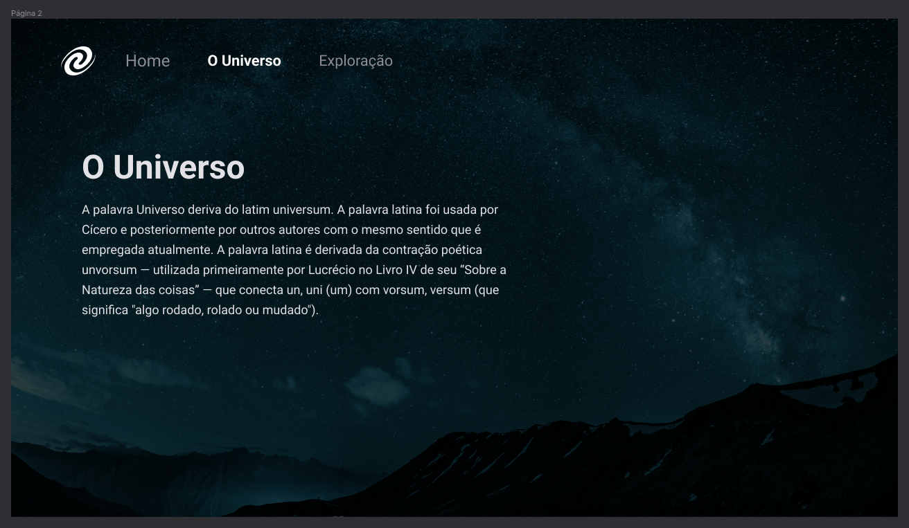

<h1 align="center"> Desafio SPA Universe ♾️</h1>

E aí, curtiu aprender todos esses novos conceitos de JavaScript? 
 
Bora praticar e rever tudo o que foi ensinado na aula? 💜 
 
A ideia agora é criar o SPA Universe! 🚀  
 
Aqui está o <a href="https://www.figma.com/file/QfBlOdICFoEegSnszTvoVi/Desafios-Explorer-SPA-Universe-Copy?fuid=1283792090047540509">LINK</a> com o layout da aplicação.

  

  <a href="#-tecnologias">Tecnologias</a>&nbsp;&nbsp;&nbsp;|&nbsp;&nbsp;&nbsp;  
  <a href="#-abordagem">O que será abordado</a>&nbsp;&nbsp;&nbsp;

 

## 🚀 Tecnologias

Esse projeto foi desenvolvido com as seguintes tecnologias:

- HTML e CSS
- JavaScript
- Git e Github
- Figma

## 🔖 Abordagem

O que será abordado nesse desafio:

<ul>
  <li>Conceitos de SPA;</li>
  <li>Mapeamento de rotas;</li>
  <li>Assíncrono e promises;</li>
  <li>Orientação a objetos;</li>
  <li>Classes e muito mais.</li>  
</ul>

Feito com ♥ by Rocketseat :wave: [Participe da nossa comunidade!](https://discord.gg/rocketseat)

